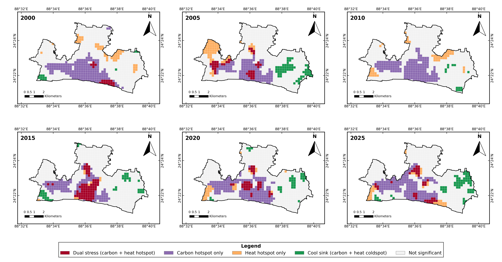
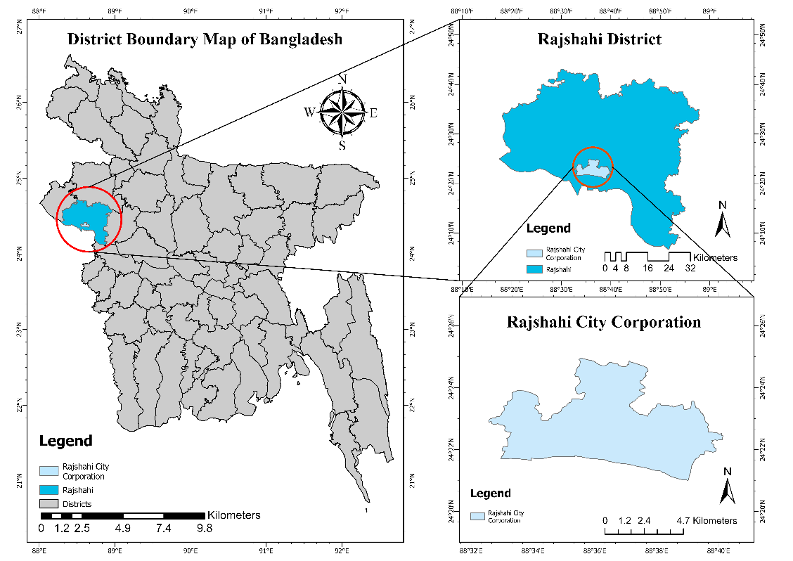
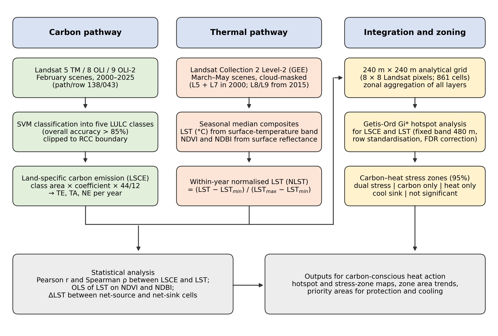
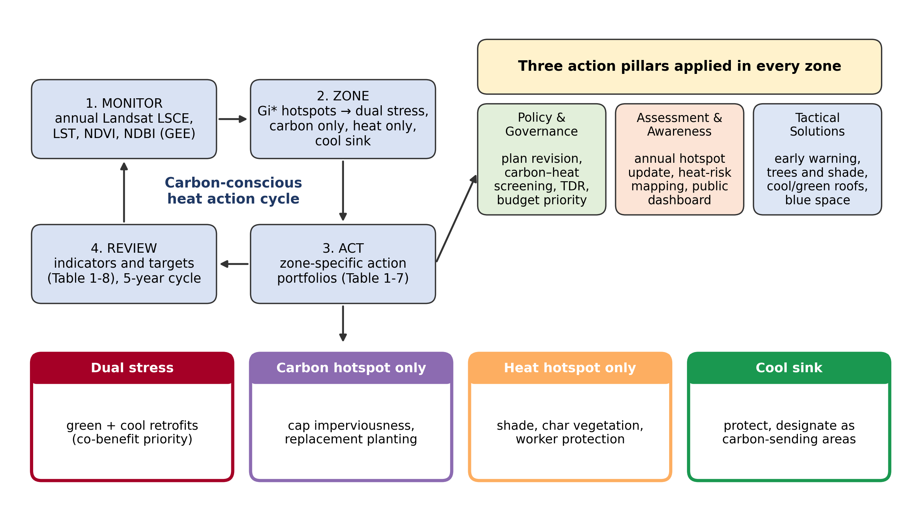

# Carbon-Conscious Urban Heat Action in Rajshahi, Bangladesh

[](https://doi.org/10.5281/zenodo.23119031)

**Where do carbon emission and urban heat meet? A remote-sensing workflow for Rajshahi City Corporation, 2000–2025**

This repository contains everything needed to understand, reproduce and adapt the study *"Carbon-Conscious Urban Heat Action through Remote Sensing-Based Assessment of Land-Specific Carbon Dynamics"*: the manuscript, the methodology, all scripts, the results tables and the figures.

> **Publication status.** The chapter abstract was accepted for the edited volume *Urban Heat Actions of 100 Global Cities* (Editor: Prof. Bao-Jie He; Springer, *Urban Climate Resilience* series). The full chapter was submitted in September 2026 and is currently under editorial review. The PDF in [`paper/`](paper/) is the authors' submitted manuscript (preprint). It has not yet been peer reviewed, and the published version may differ.

---

## Contents

1. [The study in one minute](#1-the-study-in-one-minute)
2. [Key findings](#2-key-findings)
3. [Study area](#3-study-area)
4. [Methodology](#4-methodology)
5. [Repository structure](#5-repository-structure)
6. [How to reproduce the study](#6-how-to-reproduce-the-study)
7. [Results files](#7-results-files)
8. [Adapting the workflow to another city](#8-adapting-the-workflow-to-another-city)
9. [How to cite](#9-how-to-cite)
10. [Authors, funding and contact](#10-authors-funding-and-contact)
11. [License](#11-license)

---

## 1. The study in one minute

When a city grows, trees, ponds and farmland are replaced by buildings and roads. This has two effects at the same time:

- **Carbon:** the land loses its ability to absorb carbon dioxide, and built-up land adds emissions.
- **Heat:** hard surfaces store and release more heat, so the ground becomes hotter.

Most studies look at these two problems separately. This study asks a simple question: **in which parts of the city do high carbon emission and high surface heat occur in the same place?** Those places are where one intervention (for example, planting trees) can solve two problems at once.

We answered the question for Rajshahi City Corporation (RCC), a fast-growing secondary city in north-western Bangladesh, using free satellite data from 2000 to 2025, and turned the answer into a practical heat action framework for the city.

**Key terms used throughout this repository**

| Term | Plain-language meaning |
|---|---|
| LULC | Land use / land cover: what covers the ground (water, vegetation, cropland, built-up, bare land) |
| LSCE | Land-specific carbon emission: carbon released or absorbed by each type of land cover |
| LST | Land surface temperature: how hot the ground surface is, measured by satellite |
| NDVI / NDBI | Satellite indices of greenness (vegetation) and built-up intensity |
| Net sink / net source | A sink absorbs more carbon than it emits; a source emits more than it absorbs |
| Gi\* hotspot | A statistically significant cluster of high values (hotspot) or low values (coldspot) |
| Dual-stress zone | An area that is both a carbon hotspot and a heat hotspot |
| Cool sink | An area that is both a carbon coldspot and a heat coldspot |

---

## 2. Key findings

| Indicator | 2000 | 2025 |
|---|---|---|
| Built-up land | 15.08 km² (32.1%) | 26.83 km² (57.2%), **+77.9%** |
| Vegetation | 23.42 km² (49.9%) | 13.78 km² (29.4%), **−41.2%** |
| Net carbon emission (NE) | −1.64 × 10³ t CO₂ yr⁻¹ (**net sink**) | +3.71 × 10³ t CO₂ yr⁻¹ (**net source**) |
| Grid cells acting as net carbon source | 35.2% | 67.0% |
| Dual-stress zone area | 1.06 km² | 2.18 km² (peak 4.32 km² in 2015) |
| Cool-sink zone area | 0.66 km² | 3.53 km² |

- **The city crossed from carbon sink to carbon source between 2010 and 2015.**
- **Carbon and heat became increasingly coupled.** Carbon-source cells were 0.40–1.42 °C hotter than sink cells, and the gap widened after 2010. Since 2015, more than half of the area of significant heat hotspots lies inside carbon hotspots.
- **Built-up intensity (NDBI) is the strongest predictor of surface temperature** (r = 0.65–0.86).
- **Not every carbon sink is cool.** Exposed sand and char land along the Padma River absorbs carbon in the accounting but heats up strongly before the monsoon.

<p align="center">
  <br>
  <em>Carbon–heat stress zones in Rajshahi City Corporation, 2000–2025.</em>
</p>

---

## 3. Study area

Rajshahi City Corporation (46.93 km²) lies on the northern bank of the Padma (Ganges) River, which forms its southern edge and the border with India. The climate is tropical monsoon, and March–May is the hottest and driest period of the year. The city was long known as one of the greenest in Bangladesh, but orchards, ponds and farmland have been converted to urban use over the past two decades.

<p align="center">
  <br>
  <em>Location of Rajshahi City Corporation.</em>
</p>

---

## 4. Methodology

The workflow has three parallel pathways that meet on a common analytical grid.

<p align="center">
  <br>
  <em>Methodological framework.</em>
</p>

**A. Carbon pathway**
1. Landsat scenes from February 2000, 2005, 2010, 2015, 2020 and 2025 (path/row 138/043) were classified into five LULC classes with a support vector machine (overall accuracy > 85% in every year).
2. Each class area was multiplied by an emission coefficient and converted to CO₂:
   `E_i = S_i × δ_i × 44/12`

   | LULC class | Coefficient δ (kg C m⁻² yr⁻¹) | Role |
   |---|---|---|
   | Water body | −0.0459 | Sink |
   | Vegetation | −0.0645 | Sink |
   | Crop land | +0.0497 | Source |
   | Built-up area | +0.0742 | Source |
   | Bare / char land | −0.0527 | Sink |

3. Total emission (TE, positive terms), total absorption (TA, negative terms) and net emission (NE = TE + TA) were calculated for each year.

**B. Thermal pathway**
1. All cloud-masked Landsat Collection 2 Level-2 scenes from **March to May** of each benchmark year were processed in Google Earth Engine.
2. LST (°C) was taken from the surface-temperature band; NDVI and NDBI were calculated from surface reflectance.
3. A per-pixel median composite was made for each year. Because the scene dates differ between years, years are compared with a **normalised LST** (0 = coolest, 1 = hottest cell in that year).

**C. Integration and zoning**
1. The city was divided into a **240 m × 240 m grid** (8 × 8 Landsat pixels; 861 cells).
2. LSCE density, LST, NDVI and NDBI were averaged for each cell.
3. **Getis-Ord Gi\*** hotspot analysis (fixed distance band 480 m, row standardisation, false discovery rate correction) was run separately for LSCE and LST.
4. The two results were combined at 95% confidence into five zones: dual stress, carbon hotspot only, heat hotspot only, cool sink, and not significant.
5. Correlation and regression were used to measure how strongly carbon emission and heat are related.

Full details are in the [paper](paper/) and in the step-by-step guides in [`docs/`](docs/).

---

## 5. Repository structure

```
rajshahi-carbon-heat-action/
├── README.md                 ← you are here
├── LICENSE                   ← MIT licence for code
├── CITATION.cff              ← citation information
├── requirements.txt          ← Python packages for the open-source workflow
├── paper/                    ← submitted manuscript (preprint PDF)
├── docs/                     ← step-by-step guides for every stage
├── scripts/
│   ├── gee/                  ← Google Earth Engine script (LST, NDVI, NDBI)
│   ├── arcmap/               ← ArcMap (ArcPy) scripts used in the study
│   └── opensource/           ← free Python version, no ArcGIS licence needed
├── data/                     ← study boundary and instructions for obtaining input data
├── results/                  ← all result tables (CSV)
└── figures/                  ← all maps and charts
```

---

## 6. How to reproduce the study

You can run the workflow in **two ways**. Both produce the same outputs.

| Step | What it does | Option A: ArcMap (used in the study) | Option B: Open source (free) |
|---|---|---|---|
| 1 | Download input data | [`docs/01_data.md`](docs/01_data.md) | same |
| 2 | LST, NDVI, NDBI in Google Earth Engine | [`scripts/gee/`](scripts/gee/) | same |
| 3 | Clip LULC and calculate LSCE | `scripts/arcmap/` | [`scripts/opensource/`](scripts/opensource/) |
| 4 | Build the 240 m grid and aggregate all layers | [`scripts/arcmap/`](scripts/arcmap/) | [`scripts/opensource/`](scripts/opensource/) |
| 5 | Gi\* hotspots and carbon–heat zones | [`scripts/arcmap/`](scripts/arcmap/) | [`scripts/opensource/`](scripts/arcmap/) |
| 6 | Statistics and publication maps | [`scripts/opensource/`](scripts/arcmap/) | same |

**What you need**

- A free [Google Earth Engine](https://earthengine.google.com/) account (for step 2).
- **Option A:** ArcMap 10.x with the Spatial Analyst extension (Python 2.7 is included with ArcMap).
- **Option B:** Python 3.9 or newer and the packages in `requirements.txt`:

```bash
pip install -r requirements.txt
```

Each step has its own guide in [`docs/`](docs/) that shows the expected output, and [`docs/FAQ_troubleshooting.md`](docs/FAQ_troubleshooting.md) explains the common errors we met and how to fix them.

---

## 7. Results files

| File | Contents |
|---|---|
| `results/RCC_LULC_area.csv` | Area of each LULC class per year (km²) |
| `results/RCC_LSCE_summary.csv` | Total emission, total absorption and net emission per year (10³ t CO₂ yr⁻¹) |
| `results/RCC_grid_values.csv` | Values for each of the 861 grid cells: LSCE density, LST, normalised LST, NDVI, NDBI for every year |
| `results/hotspot_zone_summary.csv` | Area of each carbon–heat stress zone per year (km²) |
| `results/RCC_LSCE_LST_statistics.csv` | Correlations, regression R² and source–sink LST difference per year |

A description of every column is given in [`results/README.md`](results/README.md).

---

## 8. Adapting the workflow to another city

The workflow uses only free data and can be applied to any city covered by Landsat. To adapt it:

1. Replace the boundary in `data/` with your city boundary.
2. Change the Landsat path/row and the hot-season months in the Earth Engine script.
3. Use your own LULC classification, or classify Landsat imagery with the same five classes.
4. Review the emission coefficients; locally calibrated values are better if available.
5. Keep the grid size close to the original (about 200–400 m) and report the size you use.

The heat action framework in Section 6 of the paper (monitor → zone → act → review) can be reused directly.

<p align="center">
  <br>
  <em>Carbon-conscious heat action framework.</em>
</p>

---

## 9. How to cite

If you use this repository, please cite the chapter:

> Rahman, M.N., Faridatul, M.I., Masbah, M.H., Faruq, M.O., Ubaidullah, M. (2026). Carbon-Conscious Urban Heat Action through Remote Sensing-Based Assessment of Land-Specific Carbon Dynamics. In: He, B.-J. (Ed.), *Urban Heat Actions of 100 Global Cities*. Urban Climate Resilience. Springer. (Submitted, under review.)

If you use the code, data or results, please also cite this repository:

> Rahman, M.N., Faridatul, M.I., Masbah, M.H., Faruq, M.O., Ubaidullah, M. (2026). *Carbon-Conscious Urban Heat Action in Rajshahi: code, data and results* (Version 1.0.1) [Software]. Zenodo. https://doi.org/10.5281/zenodo.23119031

The chapter citation will be updated with its DOI after publication. GitHub also shows a **"Cite this repository"** button generated from `CITATION.cff`.

---

## 10. Authors, funding and contact

**Authors:** Md. Naimur Rahman, Mst Ilme Faridatul, Md. Habibullah Masbah\*, Md. Omar Faruq, Md. Ubaidullah
Department of Urban & Regional Planning, Rajshahi University of Engineering & Technology (RUET), Rajshahi 6204, Bangladesh

\*Corresponding author: habibullah.ruet.urp@gmail.com

**Funding:** This work is part of a research project funded by the Directorate of Research and Extension (DRE), RUET (Research Grant No. DRE/08/RUET/764(52)/Pro/2025-26/10(6)).

**Data acknowledgement:** Landsat data courtesy of the U.S. Geological Survey. Processing was carried out in Google Earth Engine.

Questions, corrections or suggestions are welcome through the **Issues** tab of this repository or by email.

---

## 11. License

- **Code** (everything in `scripts/`) is released under the [MIT License](LICENSE).
- **Figures, tables and documentation** are released under [Creative Commons Attribution 4.0 (CC BY 4.0)](https://creativecommons.org/licenses/by/4.0/). Please credit the authors.
- **The manuscript** in `paper/` is shared as a preprint for scholarly use only. Copyright of the final published chapter will rest with the publisher.
